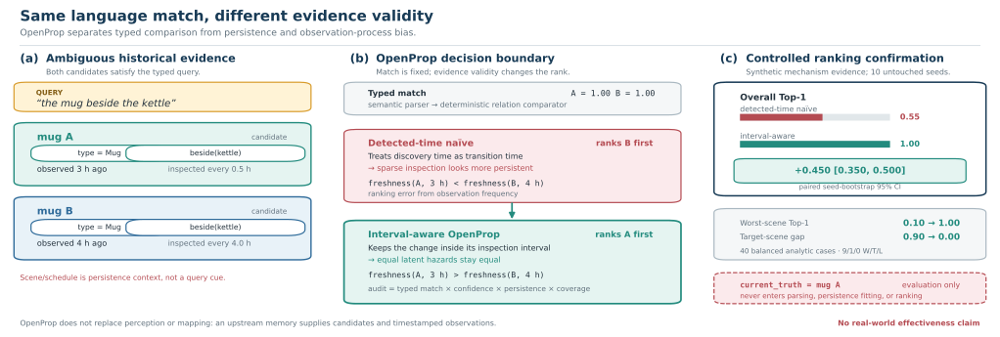
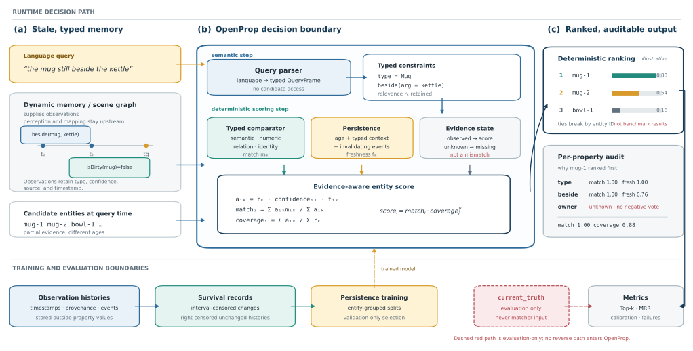

# OpenProp: Language-Conditioned Entity Grounding under Stale, Typed Evidence

> **Evidence status (2026-08-26).** This is an evidence-locked working draft.
> Controlled mechanism results and external language parsing are verified.
> The official TEACh longitudinal result is still pending, so the draft makes
> no real-world or semi-real grounding claim.
> **Release note (working-draft metadata, not submission prose).**
> `paper/reproducibility_manifest.json` must be rebuilt from a clean Git revision;
> a content hash alone is not a submission-ready revision binding.

## Abstract

An embodied agent asked for “the mug that was beside the kettle” must combine
language with memory whose values have different types, observation times, and
failure modes. Existing open-vocabulary scene representations make entities
queryable, but current-entity selection additionally requires deciding which
old state evidence remains valid and how missing evidence should affect a
rank. We formulate language-conditioned current-entity grounding as an
explicit typed decision. OpenProp separates semantic query parsing from
deterministic value-family comparators, retains unknown values as missing
evidence, and discounts state observations with a replaceable persistence
model trained from interval- and right-censored histories. On controlled
held-out context combinations, a factorized statistical persistence model
reduces mean negative log-likelihood from 1.795 to 1.239 relative to a global
model and changes Top-1 grounding from 0.000 to 1.000. Frozen ablations show
that subject, relation, and scene each improve survival calibration; separate
balanced cases confirm that each factor can independently change an entity
decision. Interval-aware estimation also reduces a synthetic inspection-
schedule hazard gap from 0.0745 to 0.0038; in a separate balanced ranking
confirmation, it improves Top-1 by 0.450 (paired seed-bootstrap 95% CI [0.350,
0.500]) and removes a 0.900 target-scene gap induced by inspection frequency.
On independently authored ALFRED
instructions, positive lexical evidence improves a train-only BM25 exact-frame
baseline by 0.124 (task-clustered 95% CI [0.071, 0.177]), but this evaluates
language parsing rather than temporal grounding. These results validate the
mechanisms and evaluation boundary; integrated semi-real longitudinal evidence
remains a required TEACh experiment.

**Figure 1: Equal typed match does not imply equal current evidence.** The left
shows two candidates that satisfy the same type and relational query but were
observed at different ages and under different inspection schedules. The center
contrasts a detected-time estimator, which mistakes sparse discovery for greater
persistence, with interval-aware OpenProp; scene and inspection schedule are
persistence context, not query cues. The right reports the frozen synthetic
controlled confirmation: interval-aware estimation improves Top-1 by 0.450
[0.350, 0.500], raises worst-scene Top-1 from 0.10 to 1.00, and reduces the
target-scene gap from 0.90 to 0.00 across ten untouched seeds. `current_truth`
is evaluation-only. This figure validates a ranking mechanism and does not
claim real-world effectiveness or replace upstream perception and mapping.

## 1. Introduction

Long-lived embodied agents must answer references to entities whose recorded
properties were observed at different times. A red cup may still be red while
its recorded location is stale; a missing owner field says nothing about
ownership; and “beside the kettle” has argument structure that should not be
collapsed into an unordered semantic resemblance. The target is not merely an
object compatible with a sentence, but the *current* entity best supported by
heterogeneous and incomplete memory.

This setting exposes three coupled problems. First, property values have
different semantics: numbers require tolerances, relations preserve argument
identity, semantic categories admit graded comparison, and identity fields may
require exactness. Second, evidence validity changes with time and context.
The persistence of a spatial relation can depend on its subject, relation, and
scene even when their full combination was absent from training. Third, the
observation process is not the latent state process: a change discovered at an
inspection occurred inside an interval, while no discovered change before the
horizon is right-censoring rather than a negative label. A system that erases
these distinctions cannot say whether a score came from semantic match,
coverage, confidence, freshness, or observation bias.

Open-vocabulary 3D representations such as
[ConceptGraphs](https://arxiv.org/abs/2309.16650) organize instances into
queryable scene graphs, while
[context-aware open-vocabulary scene graphs](https://proceedings.mlr.press/v229/chang23b.html)
and [Open3DSG](https://openaccess.thecvf.com/content/CVPR2024/html/Koch_Open3DSG_Open-Vocabulary_3D_Scene_Graphs_from_Point_Clouds_with_Queryable_CVPR_2024_paper.html)
localize or describe entities from free-form queries. Dynamic memory systems
such as
[Scene Graph Memory](https://proceedings.mlr.press/v202/kurenkov23a.html) and
[DynaMem](https://arxiv.org/abs/2411.04999) update scene structure or predict
object locations as environments change. Concurrent systems extend this scope:
[Mimir](https://arxiv.org/abs/2608.04933) binds world and task memory before
action, while [DGSG-Mind](https://arxiv.org/abs/2605.29879) couples a dynamic 3D
Gaussian scene graph with embodied reasoning.

Our target is a complementary evidence-scoring layer: given a candidate set and
timestamped historical observations, expose how typed match, missing coverage,
confidence, and learned persistence produce a current-entity decision. OpenProp
does not reconstruct geometry, update a visual map, select exploration actions,
or replace an end-to-end memory architecture. This boundary makes hidden current
truth available only to evaluation, never to matching, and prevents performance
claims across systems with different upstream perception and action stacks.

We introduce OpenProp, a modular formulation that keeps language interpretation
and deterministic entity scoring separate. A semantic parser maps language to
typed constraints and relevance weights. A registry resolves property schemas;
value-family comparators score only compatible values; and a matcher combines
relevance, confidence, freshness, match, and coverage while treating unknown as
missing evidence. Timestamped observations, events, provenance, and histories
remain outside ordinary entity properties. A replaceable persistence interface
allows fixed decay or learned survival models without changing the matching
contract. Our strongest current learned model is deliberately simple: typed
factorization, rather than neural architectural novelty, carries the controlled
compositional result.

**Figure 2: OpenProp resolves language against stale, typed memory while keeping
semantic interpretation, deterministic scoring, and evaluation truth
separate.** A dynamic memory or scene graph supplies timestamped observations;
perception and mapping remain upstream. OpenProp maps language to typed
constraints, applies value-family comparators and context-dependent persistence,
treats unknown properties as missing evidence, and reports match and coverage
with a per-property audit. Observation histories train persistence through
interval- and right-censored records. The dashed `current_truth` path is
evaluation-only. Ranking values are illustrative, not benchmark results.

We evaluate one claim at a time. Held-out typed combinations test whether
familiar factor values can be recombined. Frozen component ablations measure
calibration contribution, and untouched balanced cases test whether each factor
can change the downstream decision. A separate observation-schedule experiment
tests interval censoring. ALFRED human instructions probe only the external
language-to-frame boundary. Together these experiments support mechanism claims
but not naturalistic longitudinal effectiveness. The decisive remaining test is
a frozen TEACh protocol with egocentric observation histories, floorplan-
disjoint evaluation, and independently held current truth.

Our contributions are:

1. a typed, auditable formulation of language-conditioned current-entity
   grounding that separates semantic parsing from deterministic scoring and
   represents missing evidence explicitly;
2. an observation-aware persistence boundary that composes typed context on
   unseen combinations and uses interval/right censoring instead of fabricated
   transition labels;
3. controlled, confirmation-split evidence connecting persistence calibration
   to final entity decisions, together with negative results that reject neural
   necessity and general adaptation-safety claims; and
4. an executable claim manifest that binds paper claims to artifact hashes and
   exact metrics, plus a frozen official-data protocol for the outstanding
   longitudinal test.

## 2. Problem formulation

### 2.1 Typed entity memory

Let \(\mathcal{E}=\{e_i\}_{i=1}^{N}\) be the candidates supplied by an upstream
memory or scene representation. A registry contains a definition \(D_k\) for
each property \(k\), including its value family, aliases, optional unit,
comparator, and temporal policy. OpenProp keeps semantic, categorical, numeric,
vector, relational, entity-reference, and temporal values in their native
types. In particular, a relation is a predicate plus named arguments, such as
`inside(object=drawer)`, rather than an unstructured string or embedding.

For entity \(e_i\), the latest record for property \(k\) is
\(o_{ik}=(v_{ik},z_{ik},c_{ik},s_{ik},t_{ik})\): typed value, observation state,
confidence, source, and observation time. The state
\(z_{ik}\in\{\mathrm{observed},\mathrm{unknown},\mathrm{not\ applicable}\}\)
separates missing evidence from an observed mismatch. Timestamp, source, and
confidence are metadata on the observation record, not extra comparable
properties. Event streams and complete observation histories are stored beside
the current property snapshot rather than flattened into its value dictionary.
Thus temporal metadata can affect validity but cannot accidentally match a
language constraint.

Unknown means that the memory supplies no usable evidence. It contributes
neither positive nor negative match mass. The current ranker also assigns zero
evidence mass to not-applicable records, while retaining the distinct state in
the audit output; this is a deliberate abstention semantics, not an assertion
that the two states are ontologically identical. A hidden label
\(y_i(T)\), indicating what is actually true at decision time \(T\), exists only
in benchmark evaluation and is absent from every matching interface.

### 2.2 Language-conditioned query frame

A semantic parser maps text \(q\) and the registered schema \(\mathcal{D}\) to a
typed query frame

\[
Q=P(q,\mathcal{D})=\{(\hat{k},d_k,r_k,\tau_k)\}_{k=1}^{K},
\]

where \(\hat{k}\) is a mentioned property name, \(d_k\) is a typed desired
value, \(r_k\geq0\) is relevance, and \(\tau_k\) is an optional numeric
tolerance. Registry resolution maps \(\hat{k}\) to canonical property \(k\)
with resolution score \(\rho_k\in[0,1]\), yielding selected weight
\(w_k=r_k\rho_k\). Unresolved or zero-weight constraints are excluded. The
parser sees the query and property dictionary, not candidate entities or
current-truth labels. Once \(Q\) is fixed, comparison, freshness weighting, and
ranking are deterministic for a fixed snapshot and decision time.

### 2.3 Current-entity decision

For selected property \(k\), its typed comparator returns
\(m_{ik}=C_k(v_{ik},d_k;\tau_k)\in[0,1]\). A replaceable persistence model
returns \(f_{ik}(T)\in[0,1]\), the retained support for the observation at
decision time \(T\). Define effective evidence mass

\[
a_{ik}=w_k\mathbf{1}[z_{ik}=\mathrm{obs}]c_{ik}f_{ik}(T).
\]

OpenProp separates the quality of available evidence from how much requested
evidence is available:

\[
M_i=\begin{cases}
\dfrac{\sum_k a_{ik}m_{ik}}{\sum_k a_{ik}}, & \sum_k a_{ik}>0,\\
0, & \text{otherwise},
\end{cases}
\qquad
C_i=\dfrac{\sum_k a_{ik}}{\sum_k w_k},
\qquad
s_i=M_i C_i^{\gamma},\quad \gamma\geq0.
\]

Here \(M_i\) cannot reward a mismatch merely because another property is
missing, while \(C_i\) prevents a perfect match on one weak fragment from tying
a fully supported candidate. Every property emits an audit record containing
its base weight, observation state, typed match, effective confidence,
freshness, age, and reason. Scores are sorted descending; exact ties use lexical
entity ID. Candidate order therefore cannot affect the result, a property also
covered by executable tests. For \(N=|\mathcal{E}|\) candidates and \(K=|Q|\)
constraints, matching is \(O(|\mathcal{E}||Q|)\) plus
\(O(|\mathcal{E}|\log|\mathcal{E}|)\) sorting, excluding comparator-internal
cost; retaining all audit records uses \(O(|\mathcal{E}||Q|)\) space.

## 3. OpenProp

Figure 2 shows the complete boundary. Language selects typed constraints;
registered comparators and a persistence model transform only observed records
into evidence; the matcher produces a rank and an inspectable decomposition.
Training histories enter only the persistence learner, and evaluation truth
enters only metric computation.

### 3.1 Schema and comparator registries

`PropertyRegistry` canonicalizes case, spaces, underscores, and hyphens, then
resolves exact names and aliases before bounded fuzzy resolution. Creating a
new definition is a separate opt-in operation, including for the LLM parser;
an unknown phrase cannot silently mutate the schema. This controlled growth is
important in an open world: extensibility changes the dictionary, whereas
ordinary query processing only resolves against the current dictionary.

`ComparatorRegistry` dispatches by value family, with an optional per-property
override. Categorical and entity-reference values use case-insensitive exact
identity. Numeric and temporal values use
\(\exp(-|v-d|/\tau)\), where \(\tau\) is a query tolerance or registered scale.
Vectors use shifted cosine similarity. The dependency-free semantic baseline
uses token Jaccard and is explicitly replaceable. A relational comparator
multiplies predicate similarity by the fraction of desired named arguments
matched exactly, so swapping `subject` and `object` cannot preserve the score.
All comparator outputs are required to be finite and lie in \([0,1]\); invalid
custom extensions fail closed instead of corrupting a rank.

### 3.2 Evidence-aware matching

The matcher executes the equations in Section 2.3 without a learned cross-
candidate scorer. For each constraint it records schema-resolution-weighted
relevance \(w_k\), then multiplies it by observation confidence and freshness
to obtain \(a_{ik}\). Typed similarity affects only the numerator of \(M_i\);
it cannot manufacture coverage. Conversely, an observed but low-confidence or
stale perfect match supplies less coverage than a fresh, confident record.
Unknown and not-applicable states both skip comparison and contribute zero mass,
but retain different audit labels. This makes the current policy visible and
permits a downstream task to distinguish them later without rewriting stored
evidence.

For the fixed temporal baseline with age \(\Delta_{ik}\) and registered
half-life \(H_k\), time retention is
\(g_{ik}^{\mathrm{time}}=\max(g_k^{\min},2^{-\Delta_{ik}/H_k})\). A relevant
post-observation event \(e\), with event confidence \(p_e\) and registered
retention \(r_e\), contributes \(1-p_e(1-r_e)\). The fixed freshness is

\[
f_{ik}(T)=g_{ik}^{\mathrm{time}}
\prod_{e:t_{ik}<t_e\leq T}\left[1-p_e(1-r_e)\right].
\]

Learned models replace the time-retention term with a survival probability but
share the same event product. This isolates learned persistence from event
policy and preserves the matching contract across fixed and learned variants.

### 3.3 Observation histories and persistence

An observation history begins at a known observation time. If the transition
time is directly known, it yields an exact event at duration \(u\). If a state
was last confirmed at \(l\) and first found changed at \(u\), the event is
interval-censored in \((l,u]\). If it remains unchanged through follow-up
\(u\), the record is right-censored: its later transition time is unknown, not
negative. Records are split by entity so histories from one entity cannot
cross train, validation, and test partitions.

The main learned model is a factorized exponential survival model over five
typed categorical factors
\(x=(\text{property},\text{subject type},\text{predicate},
\text{context object},\text{scene})\):

\[
\lambda(x)=\alpha\exp\!\left(\beta_0+\sum_{j\in A}
\beta_{j,x_j}\right),\qquad
S(t\mid x)=\exp[-\lambda(x)t].
\]

The factor effects and intercept are fitted on training entities with L2
regularization. A single multiplier \(\alpha\) may be calibrated on validation
data without changing factor effects. Familiar factor values therefore compose
on an unseen complete tuple; a factor value absent from training contributes a
zero default effect, an explicit support limitation rather than an implicit
global claim. With \(S(t)=\exp(-\lambda t)\), each record contributes

\[
\mathcal{L}=\begin{cases}
\lambda u-\log\lambda, & \text{exact event},\\
\lambda u, & \text{right-censored at }u,\\
\lambda l-\log\!\left(1-e^{-\lambda(u-l)}\right),
& \text{interval-censored in }(l,u].
\end{cases}
\]

For logged observation opportunities, a two-state forward likelihood separates
the unchanged and changed latent states. Let `q0` and `q1` be state-specific
inspection probabilities, `s` changed-state sensitivity, and `f` unchanged-
state false-positive rate. Missing emissions have probabilities `1-q0` and
`1-q1`; negative emissions have probabilities `q0(1-f)` and `q1(1-s)`; and
positive emissions have probabilities `q0 f` and `q1 s`. Scaled forward-
backward EM estimates the transition hazard and these nuisance parameters from
training sequences. The extra `f` update is opt-in; default estimation retains
the earlier perfect-specificity contract rather than silently adding a degree
of freedom.
For Boolean properties that may return to a prior value, an optional two-rate
continuous-time Markov chain replaces the one-way transition with forward and
return rates. The same scaled forward--backward boundary jointly estimates both
rates and the observation parameters from logged training outcomes. At matching
time, freshness is the probability that the future Boolean state equals the
last observed value; this permits an unobserved change and return. The adapter is
property-specific and fails closed for non-Boolean values.
When opportunity times are irregular, the transition matrix for step `j` uses
its logged elapsed interval `dt_j`; absent opportunities are not interpolated as
missing results. A generalized M-step maximizes the expected CTMC transition
likelihood over both rates, while the emission update is unchanged. A common
regular grid is the special case in which every `dt_j` is equal.

The implemented comparison set also includes global exponential, smoothed
exact-context with global out-of-support backoff, factor ablations, Weibull,
Cox where its stepwise likelihood permits the metric, and neural variants.
These are baselines and stress tests. Current evidence supports the simple
factorized exponential model as the main model; OpenProp makes no neural
architecture novelty claim.

### 3.4 Language boundary

The default semantic boundary uses an OpenAI Responses request with a strict
JSON schema, validates types and relevance ranges, resolves names through the
registry, rejects duplicate constraints, and disables schema growth unless
explicitly authorized. The request contains the query and property dictionary,
not candidates. Its output is a `QueryFrame`; deterministic scoring begins only
after that boundary.

For the ALFRED language-only study, a supervised sparse baseline indexes only
train-split human descriptions and their typed frames. BM25 uses fixed
\(k_1=1.2\) and \(b=0.75\), returns no frame when no term is shared, and breaks
ties by lexical training-case ID. If the complete validation query occurred in
train, the top frame is retained unchanged. Otherwise, deterministic fusion may
add a missing property or replace a conflicting value only when an explicit
query span supplies positive typed evidence. Failure to recognize a cue never
removes a retrieved state constraint. No validation label selects these edits.
This experiment ends at typed-frame prediction: it contains no entities,
observations, persistence estimates, matcher outputs, or temporal-grounding
claim, and BM25 itself is a baseline rather than a claimed algorithmic novelty.

## 4. Experimental protocol

### 4.1 Evaluation questions

The experiments separate eight questions so that success at one boundary cannot
stand in for another. **Q1** asks whether typed factorization predicts
persistence on unseen complete combinations of familiar factors. **Q2** asks
whether subject, relation, and scene each improve survival calibration and can
each alter a controlled entity rank. **Q3** asks whether treating first
detection as an exact transition creates a spurious inspection-schedule signal
that propagates into ranking. **Q4** asks whether imperfect specificity biases
the hidden observation model and can be estimated from training sequences.
**Q5** asks whether reversible state dynamics can be identified from training
observation logs and repair current-state prediction. **Q6** asks whether
collapsing bursty elapsed intervals to their mean biases that prediction. **Q7**
asks whether positive span evidence improves a strong train-only language-to-frame retriever on independently authored instructions. **Q8**, the
submission-critical external question, asks whether
the integrated method improves longitudinal grounding on official TEACh
histories. Q1--Q6 are synthetic mechanism tests, Q7 is language-only external
evidence, and Q8 remains pending; none is relabeled to fill another question.

### 4.2 Controlled typed persistence and decisions

The compositional generator contains 18 typed contexts formed from property,
subject type, relation predicate, context object, and scene. Twelve contexts
belong to training and three each to validation and test, producing
960/240/240 histories at the default 80 histories per context. Complete tuples
are partition-disjoint, while every validation and test factor value occurs in
training. Entity/group IDs do not cross partitions. Effects are fitted only on
training histories; factorized and neural models receive one validation-only
hazard-scale calibration; test rows are evaluated once. The main comparison
uses five fixed seeds and identical latent test streams for every model.

Component attribution expands the same design to ten paired seeds and eight
fixed additive conditions: intercept only; each single axis; each pair of axes;
and full subject--relation--scene context. Negative log-likelihood (NLL) is the
predeclared primary endpoint. Each leave-one-axis-out comparison reuses the
same train, validation, test, and grounding rows as the full model, so its
paired delta isolates the named axis within the declared generator. A tied
grounding result cannot be promoted into downstream necessity merely because
survival NLL differs.

A separate decision confirmation removes that sensitivity confound. It derives
the confidence--age crossover analytically, holds non-probed context fixed, and
constructs 40 fixed analytic cases: 20 old-target and 20 new-target decisions
across subject, relation, and scene probes. Ten inspected development seeds are
used only to check frozen success criteria; ten disjoint seeds are then run once
for confirmation. Every failure remains in the aggregate. Candidate order is
alternated and reversed in tests, and `current_truth` is evaluation-only.

### 4.3 Observation-process intervention

The observation-process experiment holds the latent transition mechanism fixed
and changes only inspection frequency. Both groups follow an exponential hazard
of 0.25 per hour with 12-hour administrative follow-up, but are inspected every
0.5 or 4 hours. Each of five seeds supplies 600 training histories per schedule
and 400 independent exact-time test episodes per schedule. The naive condition
drops the interval lower bound and treats first detection as an exact event;
the interval-aware condition assigns likelihood to the last-negative/first-
positive interval. Both fit the same per-context exponential family. Hazard
mean absolute error, the absolute learned schedule gap, and exact-time test NLL
therefore measure an observation-semantics intervention rather than model
capacity.

The downstream confirmation uses the same equal-hazard scene strata and paired
latent histories, with 600 training histories per scene. Its 40 fixed analytic
cases contain two otherwise matching candidates and balance target scene 20/20;
scene enters persistence context but not the query. Overall Top-1 is primary;
worst-scene Top-1 and the absolute target-scene gap are predeclared secondary
endpoints. Cases and metrics are fixed on five development seeds before one run
on ten untouched confirmation seeds. A true-hazard oracle diagnoses attainable
behavior but is evaluation-only and is not an executable method.

A paired specificity stress reuses the irreversible hidden-state likelihood but
allows a positive result before transition with false-positive rate `f`. Five
seeds cross `f` in \{0,0.02,0.05,0.10\}, with 1,200 training sequences and 1,000
independent exact-time test records per condition. Latent training-transition
draws and test rows are paired across `f`. One EM fit fixes `f=0`; another
estimates it from training sequences only. Fixed-minus-estimated exact-test NLL
is the primary three-comparison family over the nonzero rates, using shared
paired-seed resamples and a family-wise simultaneous interval. Lower-noise rows
remain in the report even when the extra nuisance parameter does not help.

A recurrent-state stress uses a binary continuous-time Markov chain with forward
rate 0.30/h and return rates in \{0,0.15,0.30,0.45\}/h. Five paired seeds supply
600 eight-hour training observation sequences and 2,000 independent exact-state
test rows per condition. Training streams and test horizon/outcome uniforms are
shared across conditions. A joint EM fit estimates forward and return rates,
state-specific inspection, sensitivity, and false-positive rate from training
outcomes only. Irreversible-minus-reversible exact-test NLL is the primary family
over the three nonzero return rates, using 20,000 shared paired-seed resamples and
simultaneous intervals. Zero return is an excluded compatibility control; logged
data-generating rates are an oracle-style reference, not a learned comparator.

The timing stress fixes every episode at 16 opportunities and 12 hours, then
randomly orders fourteen short and two long gaps. Five paired seeds cross gap
contrasts in \{0,0.50,0.75,0.90\}; positions and training random streams are
shared across conditions. Exact-interval EM is compared with the same outcomes
collapsed to the true global mean interval. Each condition has 600 training
episodes and 20,000 independent exact-state rows. Mean-grid-minus-exact NLL is
the three-comparison primary family over nonzero contrasts, with 20,000 shared
paired-seed resamples and simultaneous intervals. Zero contrast is an excluded
regular-grid control. Total follow-up and mean interval are identical across
conditions, so the intervention isolates temporal granularity rather than
support length or time units.

### 4.4 External language protocol

The ALFRED study indexes 11,974 supported train descriptions and their typed
PDDL-derived frames, then evaluates all 945 supported validation descriptions
without fitting on validation labels. Results remain separated into valid-seen
and valid-unseen splits and into exact-train-query versus novel-query subsets,
because textual overlap is part of the protocol rather than a hidden advantage.
BM25 uses fixed conventional parameters. The hybrid retains an exact repeated
query's top frame unchanged; for a novel query, it may add or replace only a
typed value supported by an explicit positive query span.

Property F1, canonical typed-value recall, and exact-frame accuracy use every
supported description. Paired differences resample task IDs rather than
individual descriptions and stratify by task type. The oracle-at-five analysis
uses labels only to estimate retrieval coverage and is never reported as an
executable method. This protocol contains no entity observations, visual input,
persistence estimate, matcher decision, or temporal-grounding outcome.
ALFRED language remains templated and contains substantial train--validation
text overlap, so the exact/novel audit tests external authorship within that
distribution rather than broad linguistic out-of-distribution generalization.

### 4.5 Baselines, metrics, and uncertainty

Across the controlled study suite, block-appropriate survival comparisons
include no decay, validation-selected fixed half-life,
one train-only global exponential rate, smoothed exact-context estimation with
explicit global out-of-support backoff, property-only and nested typed-factor
models, the full factorized exponential model, Weibull, Cox where its stepwise
likelihood permits the metric, and a neural compositional model. Not every
model is meaningful in every block; within each reported comparison, paired
models see identical rows and share the same observation semantics unless that
semantic is the intervention. The language comparison includes evidence-only,
BM25 top-1, and BM25 plus positive evidence; frozen local LLM parsers are
secondary references rather than the minimum baseline.

Censoring-aware mean NLL is the primary survival calibration metric. C-index
measures risk ordering, integrated Brier score measures horizon calibration,
and grounding Top-1 measures final decision utility. We do not assign Cox a
continuous-event NLL that its stepwise baseline does not define. Means and
population standard deviations summarize fixed seeds. Controlled deltas are
paired by seed; language deltas are paired by case and clustered by task ID.
Intervals use 20,000 deterministic resamples at the relevant seed or task
cluster level and report win/tie/loss counts where defined. The three primary
component NLL comparisons and three axis-isolated decision comparisons each
share paired seed resamples and use a family-wise maximum standardized
mean-deviation critical value. Secondary component metrics remain comparison-wise.
Seed-bootstrap intervals summarize sensitivity across the frozen finite seed set; they do not turn a synthetic generator into
a sampled population of real environments.

All failures remain in their predeclared denominators. Parser failures count as
failed frames and failed ranks; estimation failures lower seed aggregates;
exact-overlap cases remain visible; and coverage exclusions are reported before
any identifiable-subset metric. Hidden current truth never selects a query,
candidate, model, threshold, horizon, or calibration parameter.

### 4.6 Pending official longitudinal protocol

The frozen TEACh path begins by discovering every session in the requested
official splits, validating game/replay timestamps, and hashing a portable
manifest before any feasibility filtering. Layer A checks whether replay data
contain adequate observation histories and interval-censored transitions;
Layer B constructs gold-query temporal cases with separately held final truth;
Layer C requires a fresh automatic dialogue population and an independently
labeled alignment sample with at least 0.90 precision. Whole floorplans, not
episodes, define floorplan-disjoint train/validation/test partitions.

If Layer B passes, the runner freezes no-decay, validation-selected fixed,
global, smoothed exact-context, property-only, nested, and full typed models
before evaluating test floorplans. Training fits effects, validation chooses
the fixed half-life from the predeclared
\(\{0.25,1,4,16,64,256\}\)-hour grid, calibration scale, and evaluation
horizons, and test is used once. The full model must beat the property-only
factorization before a
gain is attributed to typed context rather than property-specific persistence.
The report must expose every generated case, unobservable or input-tied
exclusion, train-support coverage for each factor value and complete tuple, and
the exact-context model's global-backoff frequency.

If Layer C also passes, every candidate is an entity observed strictly before
the recorded target action; action-time and final-state effects are excluded.
The report compares the official type oracle, a three-annotator rich oracle
only after the frozen 0.80 pairwise semantic-agreement gate, and predicted
frames replayed from the same raw responses. Type-unique, same-type ambiguous,
single-candidate, parse-failure, and target-unobserved cases retain the same
all-case denominator. No official TEACh metric appears in this paper because
the archives and completed independent labels are absent from the workspace.
The implemented protocol is therefore a fail-closed prerequisite, not a
submission-ready result.

## 5. Results

### 5.1 Typed compositional persistence

The controlled compositional experiment asks whether a persistence model can
reuse familiar typed factor values when their complete subject--relation--scene
tuple was absent from training. All rows use the same five seeds and test
streams; lower NLL and integrated Brier score are better, while higher C-index
and grounding Top-1 are better.

<!-- BEGIN GENERATED TABLE: controlled-compositional -->
<!-- Generated by scripts/build_paper_tables.py; do not edit. -->
**Table 1. Controlled compositional persistence on held-out complete context tuples. Values report mean and standard deviation across five fixed seeds; all factor values are seen during training, and every model uses the same test stream. Bold marks the best mean. This is synthetic mechanism validation, not real-world evidence.**

| Model | NLL ↓ | C-index ↑ | IBS ↓ | Grounding Top-1 ↑ |
|---|---:|---:|---:|---:|
| Global exponential | 1.795 ± 0.033 | 0.500 ± 0.000 | 0.243 ± 0.003 | 0.000 ± 0.000 |
| Factorized exponential | **1.239 ± 0.069** | **0.749 ± 0.014** | **0.079 ± 0.010** | **1.000 ± 0.000** |
| Neural compositional | 1.266 ± 0.061 | 0.723 ± 0.026 | 0.084 ± 0.009 | 0.972 ± 0.056 |

*Claim boundary:* Five-seed synthetic factorized exponential generator with held-out complete context tuples.
<!-- END GENERATED TABLE: controlled-compositional -->

The factorized exponential model has the best mean on all four reported metrics,
including lower NLL than the global model and perfect controlled Top-1. It also
slightly outperforms the neural parameterization. This supports typed
composition on the declared generator, not neural novelty or naturalistic
longitudinal effectiveness.

### 5.2 Components and downstream decisions

The component ablation asks whether each named factor contributes to survival
calibration when all of its values were seen but complete context tuples were
held out. NLL is the predeclared primary metric, and every ablation uses the
same paired test rows as the full model.

<!-- BEGIN GENERATED TABLE: typed-component-ablation -->
<!-- Generated by scripts/build_paper_tables.py; do not edit. -->
**Table 2. Typed-factor ablation on held-out context tuples. Delta NLL is NLL(ablation) minus NLL(full), so positive values favor the full model. Intervals are paired, family-wise simultaneous 95% bootstrap intervals across the three predeclared factor comparisons over ten fixed seeds on identical test rows. NLL was the predeclared primary metric. This is synthetic mechanism validation.**

| Omitted typed factor | Retained factors | ΔNLL ↑ [simultaneous 95% CI] | Wins / 10 |
|---|---|---:|---:|
| Subject | relation + scene | **0.052 [0.038, 0.066]** | 10/10 |
| Relation | subject + scene | **0.156 [0.137, 0.176]** | 10/10 |
| Scene | subject + relation | **0.402 [0.364, 0.441]** | 10/10 |

*Claim boundary:* Ten paired seeds on the declared factorized generator; NLL is the predeclared primary metric.
<!-- END GENERATED TABLE: typed-component-ablation -->

Removing subject, relation, or scene worsens paired NLL in all ten seeds, and
all three bootstrap intervals exclude zero. Scene is the largest calibration
contributor on this generator; subject is the smallest. These results establish
calibration contribution, but they do not show that every factor changes every
grounding decision.

A separate confirmation experiment tests decision utility directly. Each
analytic confidence-age crossover isolates one factor: both candidates share
all other typed context values, target-old and target-new cases are balanced,
and the ten confirmation seeds were untouched during case development.

<!-- BEGIN GENERATED TABLE: controlled-decision-utility -->
<!-- Generated by scripts/build_paper_tables.py; do not edit. -->
**Table 3. Axis-isolated entity decisions on 40 analytic confidence-age crossover cases (20 old and 20 new targets). Values report Top-1 mean and standard deviation across ten untouched confirmation seeds. Delta is full minus the matched factor-removal ablation; intervals are paired, family-wise simultaneous 95% bootstrap intervals across the three predeclared probes. This is synthetic controlled decision evidence, not natural prevalence.**

| Isolated factor | Full Top-1 ↑ | Remove factor Top-1 ↑ | Paired Δ ↑ [simultaneous 95% CI] | Wins / 10 |
|---|---:|---:|---:|---:|
| Subject | **0.973 ± 0.080** | 0.627 ± 0.100 | **0.347 [0.329, 0.364]** | 10/10 |
| Relation | **0.993 ± 0.020** | 0.667 ± 0.000 | **0.327 [0.313, 0.340]** | 10/10 |
| Scene | **1.000 ± 0.000** | 0.500 ± 0.000 | **0.500 [0.500, 0.500]** | 10/10 |

*Claim boundary:* Single frozen confirmation run on ten untouched seeds and 40 balanced synthetic cases.
<!-- END GENERATED TABLE: controlled-decision-utility -->

The full model beats the matched factor-removal ablation for every isolated
probe in all ten confirmation seeds. This establishes that each factor can
change a controlled entity decision; analytic construction prevents interpreting
the result as the natural prevalence or average magnitude of such cases.

### 5.3 Observation-process bias

We isolate detection-time bias by holding the latent exponential hazard fixed
while changing only the inspection interval. The naive estimator treats the
first inspection that detects a change as its event time; the interval-aware
estimator assigns likelihood to the entire interval in which the change occurred.

<!-- BEGIN GENERATED TABLE: observation-process-bias -->
<!-- Generated by scripts/build_paper_tables.py; do not edit. -->
**Table 4. Inspection-frequency bias under an identical synthetic exponential process (true hazard 0.25/h; inspection every 0.5 or 4.0 h). Values are mean and standard deviation across 5 fixed seeds, with 600 train and 400 exact-time test samples per schedule. Bold marks the better mean. This isolates interval-censoring mechanics; it is not evidence for arbitrary missingness or real observation processes.**

| Estimator | Hazard MAE ↓ | Schedule gap ↓ | Exact test NLL ↓ |
|---|---:|---:|---:|
| Detected-time naive | 0.056 ± 0.004 | 0.074 ± 0.006 | 2.335 ± 0.019 |
| Interval-aware | **0.006 ± 0.004** | **0.004 ± 0.004** | **2.291 ± 0.027** |

*Claim boundary:* Synthetic equal-hazard mechanism validation plus a frozen ten-seed, 40-case analytic grounding confirmation; not natural prevalence or real observation-process evidence.
<!-- END GENERATED TABLE: observation-process-bias -->

Interval-aware likelihood reduces both hazard error and the spurious difference
between inspection schedules by more than an order of magnitude, while also
improving exact-time test NLL. We then ask whether this estimation error survives
the matcher boundary. Two scene strata have identical latent persistence but
different inspection intervals; each analytic case pairs a 3-hour target
observation with a 4-hour distractor observation and balances which scene contains
the target. Scene is available only as persistence context, not as a query cue.

<!-- BEGIN GENERATED TABLE: observation-grounding-decisions -->
<!-- Generated by scripts/build_paper_tables.py; do not edit. -->
**Table 5. Downstream grounding under inspection-frequency confounding. Two scene strata share hazard 0.25/h but are inspected every 0.5 or 4.0 h. The 40 fixed cases balance target scene (20/20) and use 600 training histories per scene across 10 untouched confirmation seeds. Values are mean and standard deviation; delta rows use paired seed-bootstrap 95% intervals. Scene affects persistence context but is not queried. This is analytic synthetic decision evidence, not natural prevalence or real-world grounding.**

| Estimator | Overall Top-1 ↑ | Worst-scene Top-1 ↑ | Target-scene gap ↓ | Primary W/T/L |
|---|---:|---:|---:|---:|
| Detected-time naive | 0.550 ± 0.150 | 0.100 ± 0.300 | 0.900 ± 0.300 | — |
| Interval-aware | **1.000 ± 0.000** | **1.000 ± 0.000** | **0.000 ± 0.000** | — |
| True-hazard oracle | **1.000 ± 0.000** | **1.000 ± 0.000** | **0.000 ± 0.000** | — |
| Interval-aware advantage vs naive | **+0.450 [0.350, 0.500]** | **+0.900 [0.700, 1.000]** | **−0.900 [−1.000, −0.700]** | **9/1/0** |

*Claim boundary:* Synthetic equal-hazard mechanism validation plus a frozen ten-seed, 40-case analytic grounding confirmation; not natural prevalence or real observation-process evidence.
<!-- END GENERATED TABLE: observation-grounding-decisions -->

The detected-time estimator makes a directional error: it treats sparse
inspection as stronger persistence and reaches only 0.55 overall Top-1, with a
0.90 target-scene gap. Interval-aware learning matches the true-hazard oracle on
all ten confirmation seeds, improving paired Top-1 by 0.45 [0.35, 0.50] with
nine wins and one tie. The one tie is retained rather than excluded. These
analytic cases show that censoring semantics can change entity ranking, but they
do not establish natural effect prevalence or robustness to informative
inspection, missed detections, non-exponential dynamics, or real observation logs.

### 5.4 False-positive observation stress

Fixing specificity at one becomes detectably biased when false positives are
frequent. At false-positive rate 0.10, the fixed-specificity EM estimates hazard
0.2784 rather than the true 0.25, whereas training-only specificity estimation
gives 0.2451 and recovers `f=0.0947`. Hazard MAE falls from 0.0284 to 0.0061.
The fixed-minus-estimated exact-test NLL difference is 0.00615 [0.00343,
0.00887] with 5/5 wins; brackets are family-wise simultaneous across the three
nonzero-rate comparisons.

The lower-noise conditions prevent a broader claim. At rate 0.02, fixed
specificity has slightly lower hazard MAE and mean NLL differs by less than
0.0001. At rate 0.05, four of five seeds favor estimation, but the simultaneous
interval crosses zero. The result therefore supports an identifiable high-
violation repair under the synthetic observation model, not universal benefit
from estimating extra noise parameters.

### 5.5 Recurrent-state observation stress

The reversible model recovers mean return rates 0.1476, 0.3128, and 0.4871/h
when truth is 0.15, 0.30, and 0.45/h. Against the irreversible fit, exact-state
NLL improves by 0.06038 [0.05016, 0.07060], 0.08099 [0.07314, 0.08884], and
0.08263 [0.07560, 0.08965], respectively. Every condition wins in all five
paired seeds, and brackets are simultaneous across the three-comparison family.
The reversible NLL remains within 0.0011 of the logged-rate oracle mean in every
nonzero condition.

At zero return, irreversible and reversible NLL are 0.46056 and 0.46061. This
near-tie is a compatibility check, not an equivalence claim. The result validates
a matched reversible binary mechanism; it does not establish
real-world recurrence, multi-valued dynamics, unknown initial
states, or source-specific observation reliability.

### 5.6 Irregular observation-timing stress

Replacing every elapsed interval by the global mean increasingly underestimates
both transition rates as timing becomes bursty. At contrasts 0.50, 0.75, and
0.90, mean-grid forward/return estimates are 0.205/0.317, 0.148/0.222, and
0.106/0.142 per hour, while exact-interval estimates remain 0.286/0.442,
0.291/0.448, and 0.310/0.464 against truth 0.30/0.45.

The corresponding current-state NLL gains are 0.00391 [0.00151, 0.00630],
0.01446 [0.01217, 0.01675], and 0.03140 [0.02907, 0.03373]. All brackets are
simultaneous and every contrast wins in 5/5 seeds. On the regular grid, NLL is
0.62991 versus 0.62990. This supports exact elapsed-time conditioning under the
fixed two-gap synthetic protocol, not natural timing prevalence or robustness to
informative opportunities and timestamp error.

### 5.7 External language parsing

We next test only the semantic parsing boundary on independently authored ALFRED
task descriptions. The retrieval baseline uses fixed BM25 defaults and training
typed frames; positive lexical evidence can add or override a value only when a
recognised span supports it, and an absent cue remains unknown. Exact training
queries retain the retrieved frame unchanged.

<!-- BEGIN GENERATED TABLE: external-language-results -->
<!-- Generated by scripts/build_paper_tables.py; do not edit. -->
**Table 6. External ALFRED language-to-frame parsing with a fixed train-only BM25 retriever and positive span evidence. No validation labels select or fit the methods. Deltas and 95% intervals are paired by case and bootstrapped by task ID, stratified by task type. The methods have no candidate, matcher, visual, or temporal access.**

| Split | Method | Property F1 ↑ | Value recall ↑ | Exact frame ↑ |
|---|---|---:|---:|---:|
| Valid-seen (487) | Evidence only | 0.788 | 0.652 | 0.345 |
| Valid-seen (487) | BM25 top-1 | 0.983 | 0.818 | 0.612 |
| Valid-seen (487) | BM25 + positive evidence | **0.989** | **0.880** | **0.710** |
| Valid-seen (487) | Positive-evidence Δ vs BM25 | **+0.006 [0.003, 0.009]** | **+0.062 [0.046, 0.079]** | **+0.099 [0.064, 0.134]** |
| Valid-unseen (458) | Evidence only | 0.822 | 0.697 | 0.404 |
| Valid-unseen (458) | BM25 top-1 | 0.979 | 0.802 | 0.611 |
| Valid-unseen (458) | BM25 + positive evidence | **0.986** | **0.896** | **0.736** |
| Valid-unseen (458) | Positive-evidence Δ vs BM25 | **+0.006 [0.003, 0.010]** | **+0.094 [0.062, 0.124]** | **+0.124 [0.071, 0.177]** |

On the separate frozen 40-case valid-unseen confirmation sample, the hybrid also exceeds frozen local Gemma 3 4B by 0.450 exact-frame [0.300, 0.600] and 0.388 value recall [0.296, 0.479], and Llama 3.2 by 0.400 [0.250, 0.550] and 0.317 [0.221, 0.412], respectively.

*Claim boundary:* ALFRED valid-unseen language-to-frame parsing only; not visual, temporal, or end-to-end grounding.
<!-- END GENERATED TABLE: external-language-results -->

Positive-evidence fusion improves property F1, value recall, and exact-frame
accuracy over train-only BM25 on both validation splits, with all task-clustered
intervals excluding zero. The separate frozen local-parser comparison points in
the same direction. This experiment maps language to typed frames only: it has no
scene observations, candidate entities, persistence estimates, or matcher access,
and therefore supplies no visual, temporal, or end-to-end grounding evidence.

### 5.8 Official longitudinal grounding

> **SUBMISSION BLOCKER:** Populate only after the frozen TEACh manifest, audit,
> manual alignment sample, and floorplan-disjoint experiment pass their gates.
> Report failed denominators and unidentifiable cases; do not silently filter.

The frozen Layer C protocol separates an official target-type oracle from
strict, tolerant, and schema-repaired predicted frames. Candidates contain only
entities visible at least once strictly before the recorded target action; the
action-time state diff and final state are excluded. Report type-unique,
same-type ambiguous, target-unobserved, and parse-failure slices on the same
all-case denominator. Because the automatic alignment does not annotate richer
referential attributes, do not call the target-type condition a complete
semantic oracle. The richer-frame protocol gives three annotators only the
Commander text, fixed target type, and allowed typed state vocabulary. Every
attribute requires an exact text span; candidate properties, target identity,
timestamps, outcomes, final truth, model outputs, and other labels are hidden.
A deterministic two-of-three majority and a predeclared 0.80 pairwise exact
semantic-agreement gate are required before evaluation. This protocol is
implemented, but its official labels and results remain pending.

### 5.9 Claims withheld after adversarial evaluation

A complete result narrative must retain claims that the current evidence
contradicts or cannot yet test. Table 7 therefore records the strongest negative
result about neural necessity, the still-missing semi-real result, and the
development-only adaptation failure that prevents a general safety claim.

<!-- BEGIN GENERATED TABLE: claim-boundaries -->
<!-- Generated by scripts/build_paper_tables.py; do not edit. -->
**Table 7. Claims excluded or pending after adversarial evaluation. Negative and missing results are retained rather than hidden behind favorable averages.**

| Candidate claim | Status | Frozen evidence | Paper consequence |
|---|---|---|---|
| Neural persistence is necessary | Contradicted | Factorized vs neural: NLL 1.239 vs 1.266; C-index 0.749 vs 0.723; IBS 0.079 vs 0.084; Top-1 1.000 vs 0.972. | Claim typed factorization, not neural novelty. |
| Semi-real longitudinal effectiveness | Pending | No official TEACh longitudinal result is currently available. | Submission blocker; no performance wording is allowed. |
| Calibration-only adaptation is generally safe | Contradicted | Under 20% flips, repetition changes noisy control activations from 2/10 to 0/10, yet affected C-index changes -0.036 (95% bootstrap lower bound -0.109; worst seed -0.363). | Report an identifiability boundary, not a safety guarantee. |
<!-- END GENERATED TABLE: claim-boundaries -->

## 6. Related work

**Language-conditioned embodied tasks.**
[ALFRED](https://arxiv.org/abs/1912.01734) and
[TEACh](https://arxiv.org/abs/2110.00534) evaluate instruction following in
household environments, with TEACh adding dialogue and interaction histories.
They motivate references whose resolution depends on a changing scene, but
their end-task action metrics do not by themselves isolate whether a failure
came from parsing, candidate recall, stale evidence, or control. OpenProp defines
that missing evaluation boundary: current-entity ranking is measured with fixed
candidates and histories before it is composed with an embodied policy.

**Open-vocabulary representation and entity querying.**
[ConceptGraphs](https://arxiv.org/abs/2309.16650) builds an open-vocabulary,
graph-structured 3D representation from foundation-model features;
[OVSG](https://proceedings.mlr.press/v229/chang23b.html) grounds free-form queries
using objects and contextual relations; and
[Open3DSG](https://openaccess.thecvf.com/content/CVPR2024/html/Koch_Open3DSG_Open-Vocabulary_3D_Scene_Graphs_from_Point_Clouds_with_Queryable_CVPR_2024_paper.html)
constructs queryable open-set object and relation features from point clouds.
These methods address perception, representation, and contextual retrieval.
OpenProp can consume their candidate entities and relations, but it instead
asks how heterogeneous observations of those candidates should be compared,
discounted, and audited after retrieval. It therefore makes no claim of better
3D reconstruction or open-vocabulary localization.

**Dynamic and persistent embodied memory.**
[Scene Graph Memory](https://proceedings.mlr.press/v202/kurenkov23a.html)
accumulates a partially observed dynamic graph and predicts object locations;
[DynaMem](https://arxiv.org/abs/2411.04999) incrementally updates a
spatio-semantic 3D memory as objects move, appear, or disappear. More recent
systems use persistent multimodal memory for exploration and reasoning,
including
[3D-Mem](https://openaccess.thecvf.com/content/CVPR2025/html/Yang_3D-Mem_3D_Scene_Memory_for_Embodied_Exploration_and_Reasoning_CVPR_2025_paper.html),
[Embodied VideoAgent](https://openaccess.thecvf.com/content/ICCV2025/html/Fan_Embodied_VideoAgent_Persistent_Memory_from_Egocentric_Videos_and_Embodied_Sensors_ICCV_2025_paper.html),
and [GraphEQA](https://proceedings.mlr.press/v305/saxena25a.html). Concurrent work
broadens the overlap: [Mimir](https://arxiv.org/abs/2608.04933) dynamically binds
world-memory evidence and task state before planning, while
[DGSG-Mind](https://arxiv.org/abs/2605.29879) updates a dynamic Gaussian scene
graph for grounding and reasoning. These systems may store uncertainty, time,
or perceptual evidence; our distinction is not their absence. OpenProp isolates
a typed, decomposable current-evidence score over supplied histories, including
missing coverage and censoring, rather than proposing a complete memory,
mapping, search, or execution system.

**Survival and observation processes.** Event-time models such as
[DeepHit](https://ojs.aaai.org/index.php/AAAI/article/view/11842) learn flexible
survival distributions, while
[Survival-CRPS](https://proceedings.mlr.press/v115/avati20a.html) addresses
probabilistic calibration with right- and interval-censored observations.
Dependent-censoring methods such as
[Deep Copula Survival](https://ojs.aaai.org/index.php/AAAI/article/view/30047)
further relax independence assumptions between event and censoring processes.
OpenProp is not a general survival estimator. It places censoring-correct
persistence behind a typed grounding interface, distinguishes latent changes
from their inspection times, and measures when estimation choices alter the
final entity rank. This task-level composition and audit boundary, rather than
a new censoring objective, is the claimed contribution.

## 7. Discussion

**OpenProp's supported contribution is an explicit current-evidence decision
boundary.** The formulation makes language-conditioned grounding inspectable by
separating semantic parsing, typed comparison, confidence, freshness, match,
and coverage. This decomposition is useful precisely because these quantities
answer different questions: whether a property was requested, whether its value
matches, whether the observation remains credible, and whether enough requested
evidence exists. The controlled studies show that this boundary can expose and
repair ranking failures, but they do not make OpenProp a complete memory,
mapping, perception, or action system.

**Typed structure, rather than model capacity, carries the current
compositional result.** The factorized statistical model, not the neural
parameterization, is strongest on the held-out-combination generator. Moreover,
the component study and untouched analytic confirmation connect subject,
relation, and scene first to survival calibration and then to axis-specific
entity decisions. The defensible insight is therefore that named value families
and context factors create reusable, auditable statistical structure; it is not
that a larger persistence network is inherently better.

**The observation process is part of grounding whenever discovery time differs
from change time.** Equal latent dynamics can appear scene-dependent when one
scene is inspected less frequently, and the resulting persistence error can
reverse an otherwise identical entity comparison. Interval-aware training
removes that error in the frozen intervention because it models what the log
actually says: the transition occurred between two inspections. This connects
censoring semantics to a task-level decision rather than treating survival
calibration as an isolated auxiliary metric.
The false-positive stress further shows that the observation model must expose
specificity: estimating it removes the high-violation bias, while the retained
low-rate ties show why an additional nuisance parameter is not automatically
better. The recurrent-state stress closes a separate one-way-transition gap:
training-only logged outcomes identify both directions, while the zero-return
control shows negligible added-complexity cost under the original mechanism.
The timing stress then shows that preserving actual elapsed intervals matters
even when total follow-up and average interval are held fixed.

**The negative results constrain how the method should be used.** Neural
necessity is contradicted, noisy calibration evidence does not certify safe
adaptation, and the ALFRED result stops at typed-frame prediction. Together,
these outcomes favor a modular deployment in which low coverage and unsupported
factor values remain explicit and can be routed to abstention or declared
backoff instead of being hidden inside an automatically broader claim. They also
identify the decisive remaining question: whether the same decomposition
improves entity selection on natural longitudinal histories rather than on
mechanism-isolating cases.

## 8. Limitations and broader impact

**The current evidence does not establish naturalistic longitudinal
effectiveness.** The strongest quantitative results use synthetic generators
whose factors align with the main statistical model, and the balanced grounding
cases are analytic stress tests rather than estimates of query prevalence.
ALFRED language is independently authored but templated and includes substantial
train--validation overlap; it evaluates parsing only. Official TEACh archives,
feasibility counts, independent rich-frame annotations, and integrated results
remain absent, so no real-world or semi-real performance conclusion follows.

**The executed persistence studies cover only a subset of plausible temporal
processes.** The main model uses a factorized exponential hazard, while the
cleanest decision evidence assumes irreversible transitions and controlled
inspection schedules. The specificity stress covers homogeneous false positives
on the same irreversible regular-grid process and establishes a benefit only at
the largest tested rate. A separate binary CTMC covers matched recurrent changes
and a bursty two-gap stress covers exogenous irregular timing. Neither establishes
informative opportunity timing, timestamp uncertainty, multi-valued or
non-Markov dynamics, or unknown initial state. Real memory can contain missed
detections, source-specific reliability,
correlated sources, novel factor values, and context interactions. The replaceable
persistence interface can represent richer models, but the current results do not demonstrate robustness
to these conditions; support coverage and backoff must be reported before using
a learned freshness estimate.

**OpenProp also inherits failures from the system that supplies its candidates
and observations.** Candidate recall, cross-time identity, perception quality,
map consistency, and action-time synchronization remain upstream. A transparent
score cannot recover an entity that was never observed or correct an identity
merge using evaluation-only current truth. For this reason, unobserved targets,
input ties, provenance gaps, and candidate-set construction must remain visible
in any deployment-facing report.

**Freshness weighting can amplify unequal observation coverage if its provenance
is ignored.** Frequently monitored places, people, or object classes may appear
more current for operational rather than semantic reasons. Systems should avoid
inferring or persisting socially sensitive properties without a legitimate
task basis, retain source and timestamp audits, expose low-coverage decisions,
and permit abstention, correction, and deletion. OpenProp's decomposition makes
these failure channels inspectable, but auditability alone does not make the
underlying observations fair or appropriate.

## 9. Conclusion

This paper formulates language-conditioned current-entity grounding as a typed
decision under incomplete and stale evidence. OpenProp maps language to typed
constraints, compares values with family-specific rules, estimates whether
historical observations persist, and separates match quality from effective
evidence coverage. Unknown remains missing evidence, and current truth remains
outside the decision path.

Controlled experiments establish six mechanism-level findings: familiar
typed factors can compose on held-out context combinations; each named context
axis can alter an analytically balanced entity decision; interval-aware
learning can prevent inspection schedule from becoming a false ranking cue;
training-only specificity estimation can remove a large false-positive bias,
but does not improve every lower-noise condition; a reversible binary CTMC
repairs current-state prediction under matched return transitions; and exact
elapsed intervals prevent bursty timing from becoming a false rate signal.
External ALFRED experiments additionally support positive-evidence fusion at the
language-to-frame boundary, not visual or temporal grounding. The strongest
current model is a simple factorized statistical model, which sharpens the
paper's contribution around explicit structure and evaluation rather than
neural novelty.

The next decisive step is the frozen official floorplan-disjoint longitudinal
evaluation: qualify observation histories, preserve impossible and ambiguous
cases, compare the full typed model with property-only and simpler temporal
controls, and add language only after independent alignment and rich-frame
gates pass. Until that evidence exists, OpenProp provides a reproducible
mechanism and a falsifiable evaluation contract, not an integrated effectiveness claim.

